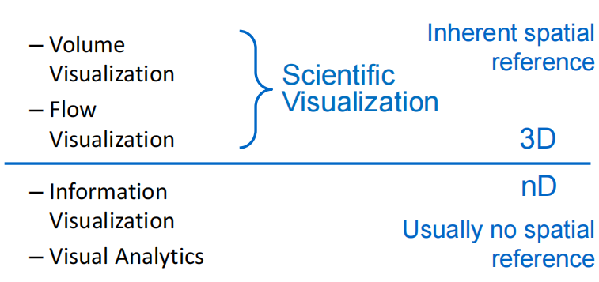
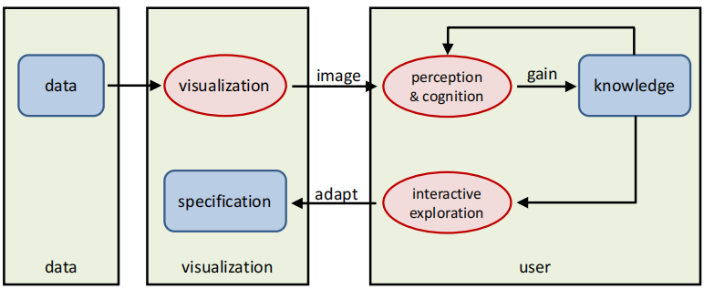
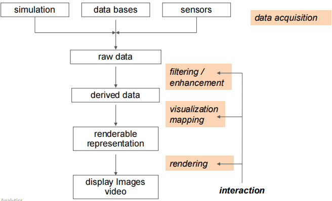

# Visualization II

## 可视化目标

可视化有助于这样的探索过程：

1. 探索阶段（对数据一无所知）

    * 探索未知
    * 做出假设

2. 分析阶段（有所假设）

    * 确认或否定假设
    * 信息深度探索

3. 结论阶段（所有皆已知）

    * 对结果进行讨论

## 主要领域

1. 三维（3D）方面

    三维领域方面在固有空间参考系下进行，进行科学可视化，主要包括：

    1. 体数据可视化（Volume Visualization）
    2. 流数据可视化（Flow Visualization）

2. 多维（nD）方面

    多维领域方面通常不具有空间参考系。

    1. 信息可视化
    2. 可视化分析

## 研究方向

可视化研究方向有三个：

1. 科学可视化（SciVis）
2. 信息可视化（InfoVis）
3. 可视分析（Visual Analytics）

目前三个方向并没有明确的分界，研究往往会涉及多个方向。

## 数据来源

## 可视化模型

## 可视化流水线

