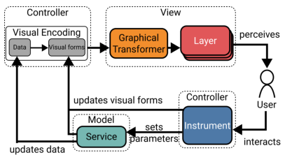
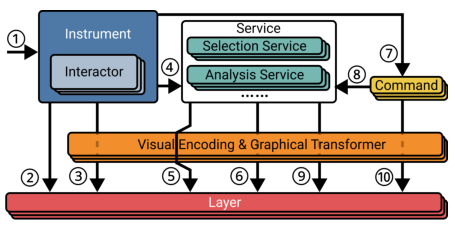

# Libra: An Interaction Model for Data Visualization

## 相关文件

[原文 PDF](paper.pdf)

[官网地址](https://libra-js.github.io/)

## 主要介绍

提出了模型 Libra，为图交互提供了工具及相关范例。

## 目标

- 为交互管理提供完整、透明的体系结构，提高可扩展性；
- 在保持高兼容性前提下，将交互与视觉表示分离；
- 最大化组件间的组合与重用，以进行高效的交互；

## Libra 结构

Libra 由四部分组成：

- 数据模型 Data Model：一种数据结构，在多个层上进行可视化；
- 层 Layer：管理一组有一致图形和交互语义的视觉元素；
- 工具 Instrument：层与用户间的中介，调度低级事件，同时通过交互器(Interactors)转化为高级操作；
- 服务 Service：工具用来管理数据模型的抽象，包括数据的查询与分析。工具通过交互的服务来访问、更改模型。

## 组件间信息交互

1. 工具接收到低级事件；
2. 工具找到事件对应的层，通过交互器处理事件；
3. 工具在相关联的层创建或操作视觉对象（默认是前向反馈）；
4. 工具调用一个或多个服务，执行查询、分析或布局任务；
5. 服务在对应层中选取视觉元素；
6. 工具通过与其层相关联的视觉编码，展现交互服务返回的中间结果；
7. 工具创建一个指令，并记录其历史，以便撤销或重做；
8. 保存更改；
9. 工具删除之前的前向反馈，并根据交互服务结果，必要时通过创建新的反馈更新图；
10. 工具删除前向反馈，命令直接产生新的反馈，必要时更新相关层；

## 层 Layer

层是被动的对象，提供绘制和选择元素的调用方法。Libra 包含以下几种层：

- 背景层：显示背景视觉元素，如坐标轴、网格、标题、刻度线等；
- 主层：显示主要的视觉表现；
- 选择层：显示所选择的元素，由选择服务进行操作；
- 临时层：展示由工具产生的临时图形元素，通常在连续交互的过程中使用；

## 工具 Instrument

工具从输入设备接受低级事件，并将它们分派给层与交互服务，已生成恰当的视觉效果和命令。

每个工具由多个交互器组成，每个交互器实质上是状态自动机，用于处理低级事件，以及将它们转化为更高级的操作：前向反馈和携带反馈的命令。

历史管理器用于管理撤销/重做的指令。

### 交互器 Interactor

交互器是由三个状态的自动机：开始、运行和范围外，其中范围外指的是其输入设备不在活动区域。

对于每个输入的低级事件，交互器提取事件信息（如鼠标位置）及可能的高级操作，

当工具使用交互器时，它将其通用操作绑定到工具特定的操作。

例：当画笔工具接收到鼠标下拉事件时，鼠标位置下没有项目，它启动一个交互器来管理矩形选择;它的启动操作将创建一个矩形并保存选择，它的运行操作将增加矩形并相应地更改选择，停止操作将使用收集的选择创建一个选择命令并将选择恢复到保存的状态。在拖动矩形时维护选择是前馈操作的一个例子。它需要在交互结束时被撤销，因为(1)交互可以被取消(例如，通过点击Escape键)，(2)因为Command对象需要在交互之前跟踪选择，以便以后能够撤销它。选择完成后，命令将被执行，选择将被设置为“for real”作为命令的效果，产生命令的最终反馈。

### 前向反馈 Feed-forward

针对用户进行显示，如果在这个时间点进行对应交互，将会发生什么。

显示预测是困难的，但应尽其所能，即使无法总是进行准确的预测。

Libra 中，前向反馈通过一组工具操控的临时对象实现，但这些数据对底层数据模型来说是不可见的。

当交互开始时，前向反馈显示在临时层。一旦交互完成，所有前向反馈的对象都被移除。这种前向反馈可以通过使用撤消功能来实现，方法是在连续的交互过程中首先应用更改，然后在最后取消更改。

此实现假定在连续交互期间执行的所有操作都可以撤消，但情况并非总是如此。前馈的视觉效果(例如，涂刷矩形的颜色)可以通过在仪器中设置共享变量来定制，并使用这些共享变量来更新相应的视觉编码以便重绘。

### 指令与反馈 Commands and Feedback

工具能产生指令对象，指令对象可以改变数据模型的状态，数据模型的改变同时产生了可视化的反馈。

命令存储在历史管理器的结尾。对于原子操作（如单击一个项目选中它），命令执行前直接存储在历史管理器中；对于连续操作（如选中一个矩形框），每个新命令都会替代历史管理器末尾的命令。

## 服务 Service

在交互过程中，有些基础操作与常用计算会由多个工具执行。为了提高模块化及支持撤销与重做，我们将其视为独立的组件——**服务**。

服务通过共享变量与可视化编码通信，在执行完成时通知可视化编码更新对应的层。

服务分为两种：通用服务与特殊服务。通用服务能适配大量可视化工作，如选择；特殊服务是可视化或交互类服务，如分析。

### 选择服务 Selection Service

该服务维护用户选择元素的列表。

选择层使用该服务为选中项目创建图形元素。

选择服务分两种：持久选择，以及鼠标悬停时的瞬时选择。

### 布局服务 Layout Service

提供允许直接操作的布局算法，如应力系统布局。

允许直接对布局进行操作，如选择并移动网络结点。

### 分析服务 Analysis Service

提供数据分析方法，如聚类、回归、分类等。

可以在特定层可视化特定的底层数据模型。

